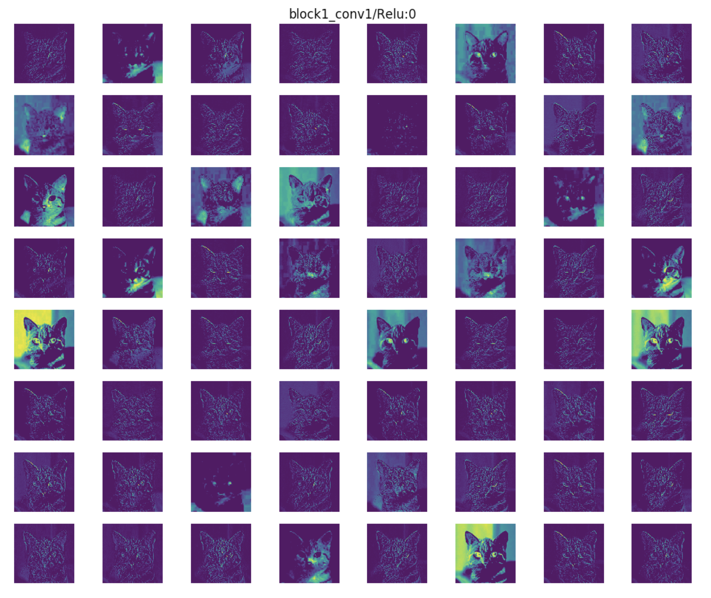
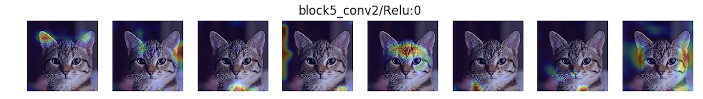

# Keract: Keras Activations + Gradients


[](https://pepy.tech/project/keract)
[](https://pepy.tech/project/keract)

```bash
pip install keract
```

*You have just found a way to get the activations (outputs) and gradients for each layer of your Keras model (LSTM, conv nets...).*

<p align="center">
  
</p>

Compatible with latest tensorflow 2.3 (from 4.3.0).

## API

- [get_activations](#get-activations-nodeslayers-outputs-as-numpy-arrays)
- [display_activations](#display-the-activations-youve-obtained)
- [display_heatmaps](#display-the-activations-as-a-heatmap-overlaid-on-an-image)
- [get_gradients_of_trainable_weights](#get-gradients-of-weights)
- [get_gradients_of_activations](#get-gradients-of-activations)
- [persist_to_json_file](#persist-activations-to-json)
- [load_activations_from_json_file](#load-activations-from-json)

### Get activations (nodes/layers outputs as Numpy arrays)

```python
keract.get_activations(model, x, layer_names=None, nodes_to_evaluate=None, output_format='simple', nested=False, auto_compile=True)
```

Fetch activations (nodes/layers outputs as Numpy arrays) for a Keras model and an input X.
By default, all the activations for all the layers are returned.

- `model`: Keras compiled model or one of ['vgg16', 'vgg19', 'inception_v3', 'inception_resnet_v2',
    'mobilenet_v2', 'mobilenetv2', ...].
- `x`: Numpy array to feed the model as input. In the case of multi-inputs, `x` should be of type List.
- `layer_names`: (optional) Single name of a layer or list of layer names for which activations should be
    returned. It is useful in very big networks when it is computationally expensive to evaluate all the layers/nodes.
- `nodes_to_evaluate`: (optional) List of Keras nodes to be evaluated.
- `output_format`: Change the output dictionary key of the function.
   - `simple`: output key will match the names of the Keras layers. For example Dense(1, name='d1') will
    return {'d1': ...}.
   - `full`: output key will match the full name of the output layer name. In the example above, it will
    return {'d1/BiasAdd:0': ...}.
   - `numbered`: output key will be an index range, based on the order of definition of each layer within the model.
- `nested`: If specified, will move recursively through the model definition to retrieve nested layers. Recursion ends at leaf layers of the model tree or at layers with their name specified in `layer_names`. For example a Sequential model in another Sequential model is considered nested.
- `auto_compile`: If set to True, will auto-compile the model if needed.

Returns: Dict {layer_name (specified by output_format) -> activation of the layer output/node (Numpy array)}.

*Example*

```python
import numpy as np
from tensorflow.keras import Input, Model
from tensorflow.keras.layers import Dense, concatenate
from keract import get_activations

# model definition
i1 = Input(shape=(10,), name='i1')
i2 = Input(shape=(10,), name='i2')

a = Dense(1, name='fc1')(i1)
b = Dense(1, name='fc2')(i2)

c = concatenate([a, b], name='concat')
d = Dense(1, name='out')(c)
model = Model(inputs=[i1, i2], outputs=[d])

# inputs to the model
x = [np.random.uniform(size=(32, 10)), np.random.uniform(size=(32, 10))]

# call to fetch the activations of the model.
activations = get_activations(model, x, auto_compile=True)

# print the activations shapes.
[print(k, '->', v.shape, '- Numpy array') for (k, v) in activations.items()]

# Print output:
# i1 -> (32, 10) - Numpy array
# i2 -> (32, 10) - Numpy array
# fc1 -> (32, 1) - Numpy array
# fc2 -> (32, 1) - Numpy array
# concat -> (32, 2) - Numpy array
# out -> (32, 1) - Numpy array
```

### Display the activations you've obtained

```python
keract.display_activations(activations, cmap=None, save=False, directory='.', data_format='channels_last', fig_size=(24, 24), reshape_1d_layers=False)
```

Plot the activations for each layer using matplotlib

Inputs are:
- `activations` dict - a dictionary mapping layers to their activations (the output of get_activations)
- `cmap` (optional) string - a valid matplotlib colormap to be used
- `save`(optional) a bool, if True the images of the activations are saved rather than being shown
- `directory`: (optional) string - where to store the activations (if save is True)
- `data_format`: (optional) tring - one of "channels_last" (default) or "channels_first".
- `reshape_1d_layers`: (optional) bool - tries to reshape large 1d layers to a square/rectangle.
- `fig_size`: (optional) (float, float) - width, height in inches.

The ordering of the dimensions in the inputs. "channels_last" corresponds to inputs with shape (batch, steps, channels) (default format for temporal data in Keras) while "channels_first" corresponds to inputs with shape (batch, channels, steps).

### Display the activations as a heatmap overlaid on an image

```python
keract.display_heatmaps(activations, input_image, save=False)
```

Plot heatmaps of activations for all filters overlayed on the input image for each layer

Inputs are:
- `activations`: a dictionary mapping layers to their activations (the output of get_activations).
- `input_image`:  numpy array of the image you inputed to the get_activations.
- `save`(optional) bool - if True the images of the activations are saved rather than being shown.
- `fix`: (optional) bool - if automated checks and fixes for incorrect images should be run.
- `directory`: string - where to store the activations (if save is True).

### Get gradients of weights

```python
keract.get_gradients_of_trainable_weights(model, x, y)
```

- `model` is a `keras.models.Model` object.
- `x`: Numpy array to feed the model as input. In the case of multi-inputs, `x` should be of type List.
- `y`: Labels (numpy array). Keras convention.

The output is a dictionary mapping each trainable weight to the values of its gradients (regarding x and y).

### Get gradients of activations

```python
keract.get_gradients_of_activations(model, x, y, layer_name=None, output_format='simple')
```

- `model` is a `keras.models.Model` object.
- `x`: Numpy array to feed the model as input. In the case of multi-inputs, `x` should be of type List.
- `y`: Labels (numpy array). Keras convention.
- `layer_name`: (optional) Name of a layer for which activations should be returned.
- `output_format`: Change the output dictionary key of the function.
   - `simple`: output key will match the names of the Keras layers. For example Dense(1, name='d1') will
    return {'d1': ...}.
   - `full`: output key will match the full name of the output layer name. In the example above, it will
    return {'d1/BiasAdd:0': ...}.
   - `numbered`: output key will be an index range, based on the order of definition of each layer within the model.

Returns: Dict {layer_name (specified by output_format) -> grad activation of the layer output/node (Numpy array)}.

The output is a dictionary mapping each layer to the values of its gradients (regarding x and y).

### Persist activations to JSON

```python
keract.persist_to_json_file(activations, filename)
```

- `activations`: activations (dict mapping layers)
- `filename`: output filename (JSON format)

### Load activations from JSON

```python
keract.load_activations_from_json_file(filename)
```

- `filename`: filename to read the activations from (JSON format)

It returns the activations.

## Examples

Examples are provided for:
- `keras.models.Sequential` - mnist.py
- `keras.models.Model` - multi_inputs.py
- Recurrent networks - recurrent.py

In the case of MNIST with LeNet, we are able to fetch the activations for a batch of size 128:

```
conv2d_1/Relu:0
(128, 26, 26, 32)

conv2d_2/Relu:0
(128, 24, 24, 64)

max_pooling2d_1/MaxPool:0
(128, 12, 12, 64)

dropout_1/cond/Merge:0
(128, 12, 12, 64)

flatten_1/Reshape:0
(128, 9216)

dense_1/Relu:0
(128, 128)

dropout_2/cond/Merge:0
(128, 128)

dense_2/Softmax:0
(128, 10)
```

We can visualise the activations. Here's another example using VGG16:

```bash
cd examples
pip install -r examples-requirements.txt
python vgg16.py
```

<p align="center">
  
  <br><i>A cat.</i>
</p>


<p align="center">
  
  <br><i>Outputs of the first convolutional layer of VGG16.</i>
</p>

Also, we can visualise the heatmaps of the activations:

```bash
cd examples
pip install -r examples-requirements.txt
python heat_map.py
```

<p align="center">
  
</p>

