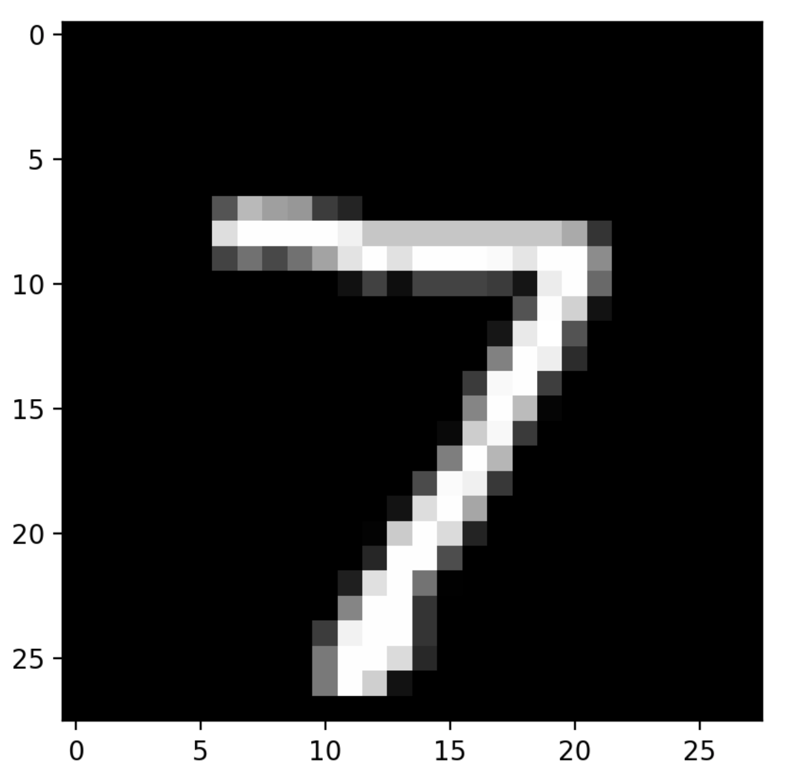
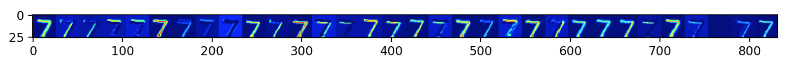
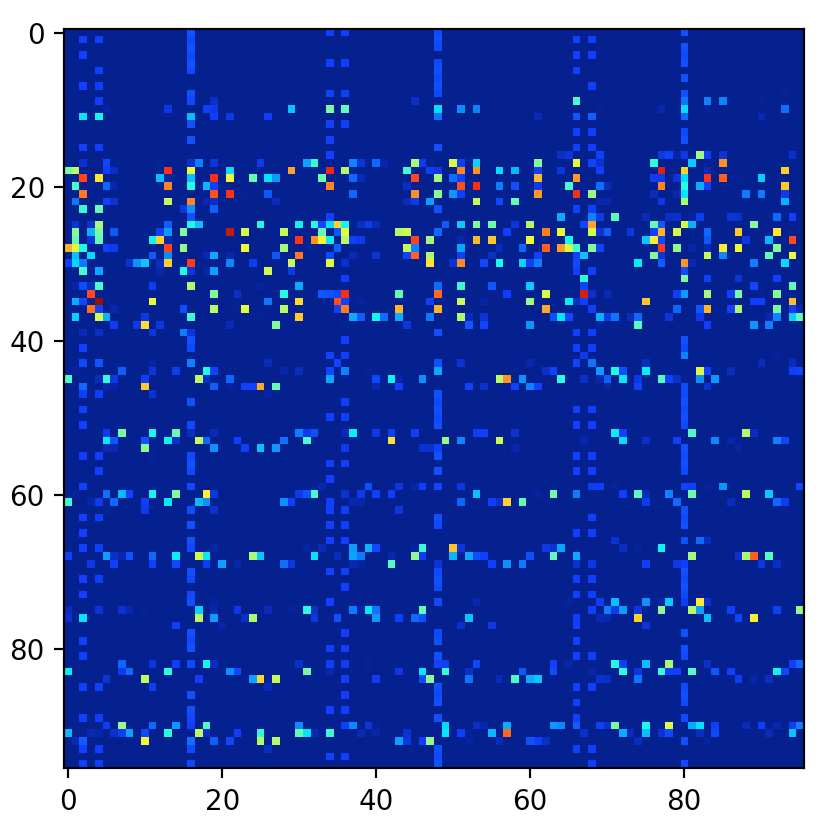
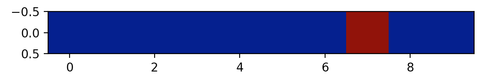

# Visualize the Activations of your layers with Keras
*Code and useful examples to show how to get the activations for each layer for Keras.*

<hr/>

<p align="center">
  
  <br><i>A random seven from MNIST</i>
</p>

<hr/>

<p align="center">
  
  <br><i>Activation map of CONV1 of LeNet</i>
</p>

<hr/>

<p align="center">
  
  <br><i>Activation map of FC1 of LeNet</i>
</p>

<hr/>

<p align="center">
  
  <br><i>Activation map of Softmax of LeNet. <b>Yes it's a seven!</b></i>
</p>

<hr/>


The function to visualize the activations is in the script [read_activations.py](https://github.com/philipperemy/keras-visualize-activations/blob/master/read_activations.py)

Inputs:
- `model`: Keras model
- `model_inputs`: Inputs to the model for which we want to get the activations (for example 200 MNIST digits)
- `print_shape_only`: If set to True, will print the entire activations arrays (might be very verbose!)
- `layer_name`: Used to retrive the activation of a specific layer, if the name matches one of the existing layers.

Outputs:
- returns a list of each layer (by order of definition) and the corresponding activations.

# Example 1: MNIST

I provide a simple example to see how it works with the MNIST model. I separated the training and the visualizations because if the two are done sequentially, we have to re-train the model every time we want to visualize the activations! Not very practical! Here are the main steps:

## Steps

Running `python model_train.py` will do:

- define the model
- if no checkpoints are detected:
  - train the model
  - save the best model in checkpoints/
- load the model from the best checkpoint
- read the activations

## Activations
Shapes of the activations (one sample):
```
----- activations -----
(1, 26, 26, 32)
(1, 24, 24, 64)
(1, 12, 12, 64)
(1, 12, 12, 64)
(1, 9216)
(1, 128)
(1, 128)
(1, 10) # softmax output!
```

Shapes of the activations (200 samples):
```
----- activations -----
(200, 26, 26, 32)
(200, 24, 24, 64)
(200, 12, 12, 64)
(200, 12, 12, 64)
(200, 9216)
(200, 128)
(200, 128)
(200, 10)
```

# Example 2: Model with multi inputs

`model_multi_inputs_train.py` contains very simple examples to visualize activations with multi inputs models. 
